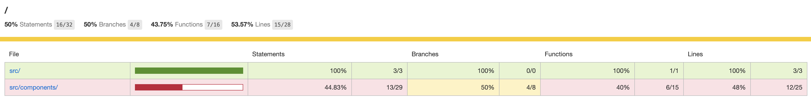
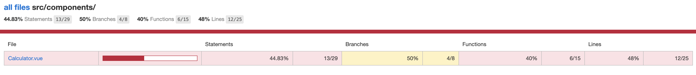
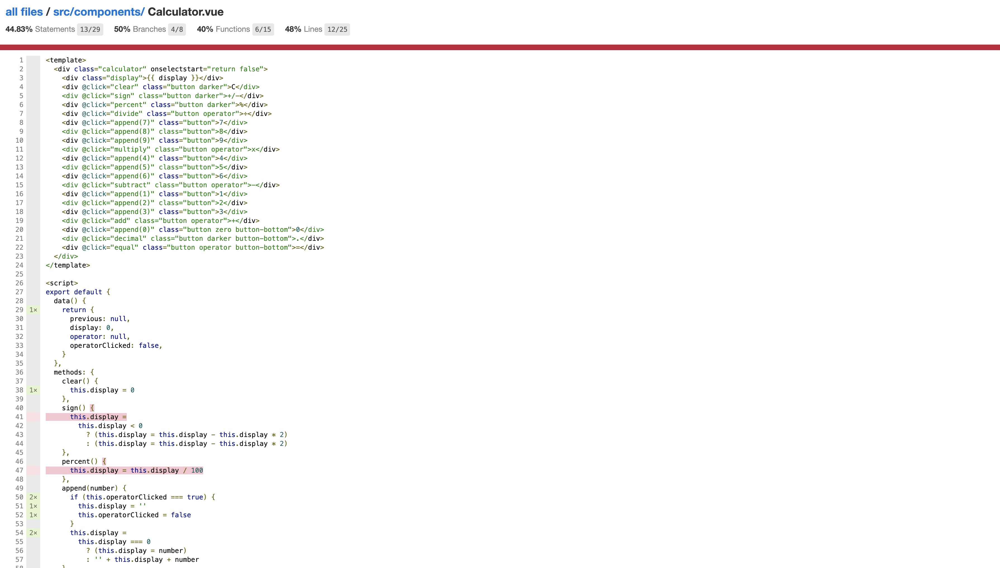

# App - Calculator

> A Vue demo, collect code coverage for manual e2e test.

## Plugin: istanbul

### Instrument source code

> Refer: <https://github.com/istanbuljs/babel-plugin-istanbul>

1. Install:

```sh
npm install --save-dev babel-plugin-istanbul
```

2. Edit `babel.config.js` to add plugin `babel-plugin-istanbul`, and config.

3. Run calculator app with instrumented code.

```sh
npm run serve-test
```

4. Open web, and check var `window.__coverage__` in chrome console to see coverage data.

------

## Plugin: istanbul-middleware

> Refer: <https://github.com/gotwarlost/istanbul-middleware>

Install:

```sh
npm i istanbul-middleware --save-dev
npm i nyc --save-dev

# check
npx nyc --version
```

### Server-side code coverage

1. Add `server.js`.

2. Start coverage server at `:8081`.

```sh
# start app
COVERAGE=true node server.js

# check coverage api
curl -v http://localhost:8081/coverage/
```

3. Copy coverage data from console by `JSON.stringify(window.__coverage__)`, and save to file `tmp.json`.

4. Upload and download coverage data.

```sh
# upload
curl -v -XPOST http://localhost:8081/coverage/client -H "Content-type:application/json" -d @tmp.json
# {"ok":true}

# download
curl -v http://localhost:8081/coverage/download --output cover.zip
# extract
unzip cover.zip -d cover
```

5. Open code coverage report from `cover/lcov-report/index.html`.

------

## E2E Test with Coverage

### Build nginx proxy

1. Start:

```sh
nginx
```

2. Update config, add proxy for code coverage server.

`/usr/local/etc/nginx/nginx.conf`

```conf
http {
    log_format  main  '$remote_addr - $remote_user [$time_local] "$request" '
                      '$status $body_bytes_sent "$http_referer" '
                      '"$http_user_agent" "$http_x_forwarded_for"';

    access_log  /tmp/nginx-access.log  main;

    # code coverage server
    upstream backend {
        server localhost:8081;
    }

    # update listen port
    server {
        listen       9090;
        server_name  localhost;

        location /coverage {
            proxy_pass http://backend;
        }
    }
}
```

3. Test and restart nginx.

```sh
nginx -t
nginx -s reload
```

4. Open `http://localhost:9090` to check ngnix.

### E2E Test and Coverage

> Pre condition: make sure coverage server is started at `:8081`.

1. Build instrumented package, and deploy to nginx.

```sh
npm run build-test
cp -r dist/* /usr/local/var/www
```

2. Open `http://localhost:9090` and run manual test of calculator.

3. Upload coverage to server.

4. Download coverage data and extract.

```sh
rm -r cover*; curl -v http://localhost:9090/coverage/download --output cover.zip
unzip cover.zip -d cover
```

5. Open code coverage report from `cover/lcov-report/index.html`.







